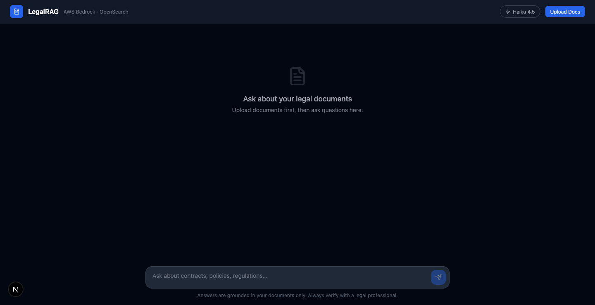
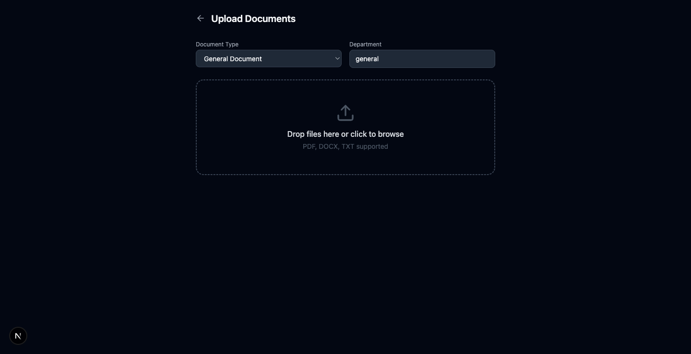

<div align="center">

# ⚖️ LegalRAG

### Production RAG System for Legal Document Intelligence

[](https://fastapi.tiangolo.com)
[](https://nextjs.org)
[](https://pinecone.io)
[](https://aws.amazon.com)
[](https://python.org)
[](LICENSE)

**Upload legal documents → Chat with them → Get cited, grounded answers**

**Live Demo:** https://legalrag-ui.vercel.app

*Built for the [Euron AI Architect Mastery](https://euron.one) bootcamp*

</div>

---

## 🎯 What Is This?

LegalRAG is a **two-pipeline production RAG system** for legal teams. Upload contracts, case files, regulations — then ask questions and get precise answers with exact citations.

**Two pipelines. No hallucinations. Source citations on every answer.**

```
Pipeline 1: Upload PDF/TXT → S3 → Chunk → Embed → Pinecone
Pipeline 2: Question → Embed → Hybrid Search → Rerank → LLM → Cited Answer (SSE stream)
```

---

## 🖼️ Screenshots

| Chat Interface | Document Upload |
|---|---|
|  |  |

---

## 🏗️ Architecture

```
┌─────────────────────────────────────────────────────────────────┐
│                         PIPELINE 1: INGEST                       │
│                                                                   │
│  [Upload UI] → [S3 Bucket] → [SHA-256 Dedup/DynamoDB]           │
│                                    │                              │
│                         [Hierarchical Chunker]                   │
│                      Parent: 1500t │ Child: 512t                 │
│                                    │                              │
│                    [Euri API / Bedrock Embeddings]               │
│                         text-embedding-3-small                    │
│                                    │                              │
│                       [Pinecone Serverless Index]                │
│                         1536-dim cosine similarity               │
└─────────────────────────────────────────────────────────────────┘

┌─────────────────────────────────────────────────────────────────┐
│                         PIPELINE 2: QUERY                        │
│                                                                   │
│  [Chat UI] → [Embed Query] → [Pinecone Vector Search k=15]      │
│                                    │                              │
│              [Custom Re-ranker: semantic×0.6 + keyword×0.4]     │
│                         Top 5 chunks selected                    │
│                                    │                              │
│              [GPT-4o-mini / Nova Lite — SSE Streaming]          │
│                                    │                              │
│              [Answer + Source Citations → UI]                    │
└─────────────────────────────────────────────────────────────────┘
```

---

## 🛠️ Tech Stack

| Layer | Technology |
|-------|-----------|
| **Frontend** | Next.js 15, TypeScript, Tailwind CSS |
| **Backend** | FastAPI, Python 3.12, Pydantic v2 |
| **Embeddings** | Euri API (text-embedding-3-small, 1536-dim) |
| **LLM** | Euri API → GPT-4o-mini (or AWS Bedrock Nova) |
| **Vector Store** | Pinecone Serverless (free tier, cosine, 1536-dim) |
| **Document Store** | AWS S3 (versioned) |
| **Dedup** | AWS DynamoDB (SHA-256 file + chunk hash) |
| **Streaming** | Server-Sent Events (SSE) |
| **Deployment** | Render (backend) + Vercel (frontend) |

---

## ⚡ Quick Start

### Prerequisites
- Python 3.12+
- Node.js 18+
- [Pinecone](https://pinecone.io) account (free)
- [Euri API](https://euron.one) key (or AWS credentials)
- AWS account (for S3 + DynamoDB)

### 1. Clone & Setup

```bash
git clone https://github.com/aiagentwithdhruv/legalrag
cd legalrag

# Copy env template
cp .env.example .env
# Edit .env with your API keys
```

### 2. Create Pinecone Index

```bash
# Install pinecone client
pip install pinecone

# Create index (1536-dim, cosine, serverless)
python scripts/setup/create_pinecone_index.py
```

### 3. Create AWS Resources

```bash
# S3 bucket + DynamoDB tables (one-time setup)
bash scripts/setup/01_create_s3.sh
bash scripts/setup/02_create_dynamodb.sh
```

### 4. Run Backend

```bash
cd backend
pip install -r requirements.txt
uvicorn app.main:app --reload --port 8000
```

### 5. Run Frontend

```bash
cd frontend
npm install
echo "NEXT_PUBLIC_API_URL=http://localhost:8000" > .env.local
npm run dev
```

Open [http://localhost:3000](http://localhost:3000) — upload a document on the Upload page, then chat!

---

## 📁 Project Structure

```
LegalRAG/
├── backend/
│   ├── app/
│   │   ├── main.py                 ← FastAPI app
│   │   ├── config.py               ← Pydantic Settings
│   │   ├── routes/
│   │   │   ├── health.py           ← GET /health
│   │   │   ├── ingest.py           ← POST /ingest/upload-url, /ingest/process
│   │   │   └── query.py            ← POST /query (SSE)
│   │   └── services/
│   │       ├── embedder.py         ← Euri / Bedrock embeddings
│   │       ├── chunker.py          ← Hierarchical parent/child chunking
│   │       ├── extractor.py        ← Text extraction (PDF, TXT, DOCX)
│   │       ├── indexer.py          ← Router: Pinecone or OpenSearch upsert
│   │       ├── retriever.py        ← Router: Pinecone or OpenSearch search
│   │       ├── reranker.py         ← Custom semantic + keyword reranker
│   │       ├── generator.py        ← SSE streaming (Euri / Bedrock)
│   │       ├── dedup.py            ← SHA-256 + DynamoDB deduplication
│   │       ├── pinecone_store.py   ← Pinecone upsert + search
│   │       └── cache.py            ← ElastiCache semantic cache
│   ├── Dockerfile
│   └── requirements.txt
├── frontend/
│   └── src/
│       └── app/
│           ├── page.tsx            ← Chat interface
│           └── upload/page.tsx     ← Document upload
├── scripts/setup/                  ← AWS infrastructure setup scripts
├── sample-docs/                    ← 5 Indian civil case files (test data)
├── prompts/                        ← System prompt templates
├── render.yaml                     ← Render deployment config
├── .env.example                    ← Environment variable template
└── docker-compose.yml
```

---

## 🔌 API Reference

### `GET /health`
```json
{ "status": "ok", "embed_model": "text-embedding-3-small", "llm_model": "gpt-4o-mini" }
```

### `POST /ingest/upload-url`
Get presigned S3 URL for direct upload.
```json
// Request
{ "filename": "contract.pdf", "department": "legal", "clearance_level": "public", "doc_type": "contract" }

// Response
{ "upload_url": "https://s3.amazonaws.com/...", "s3_key": "documents/contract.pdf" }
```

### `POST /ingest/process`
Process an uploaded document through the ingestion pipeline.
```json
// Request
{ "s3_key": "documents/contract.pdf", "filename": "contract.pdf", "department": "legal", "clearance_level": "public", "doc_type": "contract" }

// Response
{ "doc_id": "documents/contract.pdf", "status": "indexed", "chunks_indexed": 12 }
```

### `POST /query` (SSE Stream)
```json
// Request
{ "query": "What are the termination clauses?", "department": "legal", "stream": true }

// Response (SSE events)
data: {"type": "text", "content": "The termination clause..."}
data: {"type": "sources", "sources": [{"filename": "contract.pdf", "page": 3, "citation_id": "..."}]}
data: [DONE]
```

---

## 🚀 Deployment

### Backend → Render

1. Fork this repo
2. Create a new **Web Service** on Render
3. Connect your fork → Docker runtime
4. Set environment variables (from `.env.example`)
5. Deploy

### Frontend → Vercel

```bash
cd frontend
vercel --prod
# Set NEXT_PUBLIC_API_URL = your Render backend URL
```

---

## 🧠 Key Design Decisions

**Hierarchical Chunking** — Parent chunks (1500 tokens) store full context; child chunks (512 tokens) are embedded and retrieved. This gives semantic precision with full-context generation.

**Dual Vector DB Support** — Routes to Pinecone (free serverless, demo-friendly) or OpenSearch (BM25 + kNN hybrid, production). Switch via `VECTOR_DB=pinecone|opensearch`.

**Euri API as Bedrock Fallback** — AWS Bedrock requires marketplace payment instruments and quota approvals. Euri API provides OpenAI-compatible models with instant access — perfect for development and demos.

**SHA-256 Dedup at Two Levels** — File-level (DynamoDB) prevents re-processing the same document. Chunk-level prevents duplicate vectors on re-upload.

**SSE Streaming** — All LLM responses stream token-by-token via Server-Sent Events. No blocking waits.

---

## 📊 Evaluation

```bash
cd evaluation
python ragas_eval.py
```

Target metrics:
- **Faithfulness:** > 0.90 (no hallucinated citations)
- **Answer Relevancy:** > 0.85
- **Context Precision:** > 0.80

---

## 🧑‍💻 Built By

**Dhruv** — AI Engineer & Educator at [euron.one](https://euron.one)

Built as part of the **Euron AI Architect Mastery** bootcamp — teaching how to build production-grade AI systems on AWS.

- YouTube: [AIwithDhruv](https://youtube.com/@aiwithdhruv)
- LinkedIn: [Connect](https://linkedin.com/in/aiwithdhruv)

---

## 📄 License

MIT — Use it, fork it, build on it.

---

<div align="center">

**⭐ Star this repo if it helped you build something awesome**

</div>
